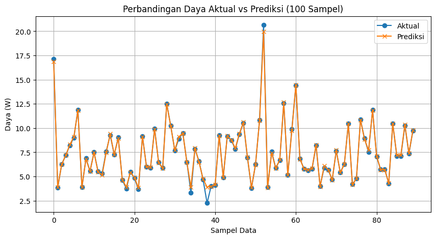

  

Machine Learning | IoT | Solar Energy | Random Forest Regressor
   

# 🌞 Solar Power Prediction using LDR Sensor Data and Random Forest

### 📘 Overview

This project predicts the output power (in Watts) of a solar concentrator system using machine learning techniques.
The data was collected from an IoT-based vertical solar concentrator that uses LDR sensors, ESP32-Dev-Kit, and voltage/current measurements.

A Random Forest Regressor model is trained to predict solar panel power output with very high accuracy.
This work demonstrates how sensor-based solar systems can be integrated with data analytics for intelligent performance prediction.

**This research demonstrates a data-driven approach for optimizing solar energy systems through intelligent prediction models.**

> _Developed as part of undergraduate research at Universitas Gadjah Mada (UGM), focusing on IoT-based solar energy optimization._

---

### ⚙ Dataset Description
The dataset was collected over 3 days, with approximately 150 records per day at 2-minute intervals. Each day includes two modes:

#### •	Tracking mode: 
the system automatically follows sunlight.

#### •	Static mode: 
the system stays fixed.

#### • Features & Descriptions 

| Feature | Description |
|----------|-------------|
| waktu | Timestamp (HH:MM) |
| Hari | Day of experiment (1–3) |
| mode | Tracking / Static |
| LDR_L1, LDR_L2, LDR_L3 | Left-side LDR sensor readings |
| LDR_R1, LDR_R2, LDR_R3 | Right-side LDR sensor readings |
| LDR_U1, LDR_U2, LDR_U3, LDR_U4 | Upper-side LDR sensor readings |
| Arus | Current (A) |
| tegangan | Voltage (V) |
| Daya | Power (W) |

**Total Data: 450 samples**

📂 [View Dataset](data/data_putra.csv)

---

### 🔍 Exploratory Data Analysis (EDA)
•	Left and right LDR sensors show consistent light intensity differences throughout the day.\
•	Strong correlation is found between voltage and output power, confirming the physical relationship.\
•	The upper LDR sensors provide valuable sunlight direction information for tracking accuracy.

---

### 🧠 Machine Learning Pipeline
1.	Data Cleaning - Fix decimal formats and convert numeric values.
2.	Feature Selection – 10 LDR sensors + current and voltage as features.
3.	Train/Test Split – 80% training, 20% testing.
4.	Model – RandomForestRegressor (n_estimators=100)
5.	Evaluation Metrics:\
•	R² Score: **0.995**\
•	Mean Absolute Error (MAE): **0.091**\
•	Root Mean Square Error (RMSE): **0.212**

---

### 📊 Results & Insights
•	The model predicts power output with **very high accuracy**.\
•	The most influential features are **voltage** and **upper LDR sensors**.\
•	This model can be integrated into **real-time solar monitoring system** for power estimation and performance analysis.

> These findings highlight the potential of integrating IoT sensor data and machine learning for optimizing solar concentrator performance.

---

### 📈 Visualizations
•	Predicted vs Actual Power\
•	Feature Importance Graph\
•	Time-series comparison (first 100 samples)

   
   \
   _(Sample visualization: actual vs predicted power curve from the trained model.)_

(_All visualizations are automatically generated in the notebook_.)

---

### 🧰 Tools & Libraries
**•	Python**\
**•	Pandas, NumPy**\
**•	scikit-learn**\
**•	Matplotlib**\
**•	Google Colab**

---

###  🚀 How to Run
1.	Clone this repository:\
   • _git clone https://github.com/raputra18/Solar-Power-MachineLearning.git_
  	• _cd Solar-Power-MachineLearning_
2. Install dependencies:\
   pip install -r requirements.txt 
3. Open the notebook:\
   ➡ [Open Model Training Notebook](notebooks/model_training.ipynb)
4. Upload your **data_putra.csv** file inside the /data/folder if not already included. 
5. Run all cells in Google Colab or Jupyter Notebook to see results and visualizations.

---

### 🚧 Future Work
•	Integrate with **Firebase IoT dashboard** for real-time prediction.\
•	Compare model performance with **Neural Network regression** or **XGBoost**.\
•	Apply model on **different weather conditions** for robustness testing.

---

## ✍ Author

#### Rahmadi Putra Aji 
#### Undergraduate Student – Instrumentation and Control Engineering (TRIK), Universitas Gadjah Mada
#### 📍 Passionate about IoT, Control Systems, and Applied Machine Learning
📫 rahmadi.putra.aji@mail.ugm.ac.id, | https://www.linkedin.com/in/rahmadiputraaji2001 

---

## ⚖ License

**This project is licensed under the MIT License.**\
**You are free to use, modify, and distribute the code with proper attribution.**
